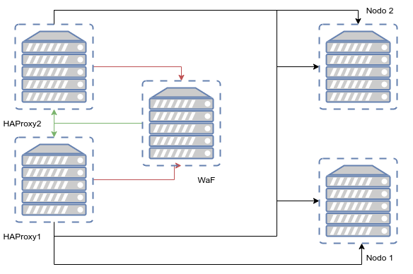
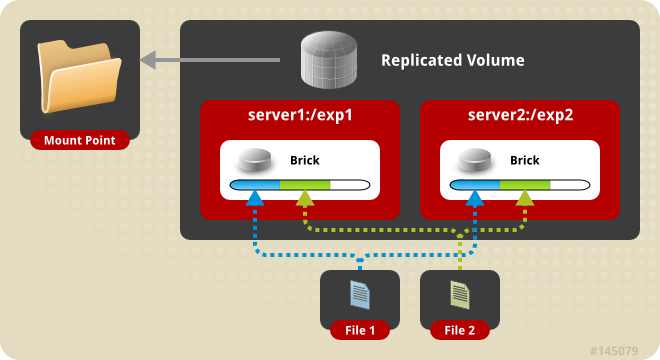

# Visión general

Se va a construir un cluster para mejorar la disponibilidad de los sistemas, optimizar los tiempos de carga y mejorar la seguridad, todos los servidores se montan sobre Ubuntu 20.04 LTS y el proveedor OVH

## Objetivos

* Alta disponibilidad entre balanceadores de carga para tener siempre un punto de entrada disponible
* Disponibilidad de un WaF para mejorar la seguridad de las aplicaciones.
* Alta disponibilidad de los ficheros mediante GlusterFs teniendo replicación en todos los nodos.
* Alta disponibilidad de base de datos con Mysql Galera

## Funcionamiento general

* Las peticiones entrar por los balanceadores de carga, donde se finaliza el SSL para poder realizar el análisis de las conexiones.
* Se remiten al WaF que revisar la seguridad de la petición y mitigar los intentos de hackeos como SQLi, XSS…
* Una vez analizada la petición es devuelta al balanceador de carga, si la petición es buena la envía a los nodos GLAMP, si la petición es mala se informa al balanceador para que a la décima petición se corte la conexión contra el cluster.



## Creación de recursos en OVH

### Configuración Fontales

Lo primero que tenemos que realizar es actualizar nuestros servidores para tener los ultimos parches

```bash
apt update
apt upgrade
```

#### IP interna VRack

Ahora vamos a asignarle una ip interna del VRack que nos asignaron el el panel de OVH para que tengamos acceso a todas las maquinas de nuestra LAN privada.

En ubuntu desde 18.04 LTS, la configuración de red se hace con [netplan](https://netplan.io/) para ello vamos a editar el siguiente fichero:

```bash
vim /etc/netplan/50-cloud-init.yaml
```

Que al abrirlo por primera vez tiene el siguiente aspecto

```bash
# This file is generated from information provided by
# the datasource.  Changes to it will not persist across an instance.
# To disable cloud-init's network configuration capabilities, write a file
# /etc/cloud/cloud.cfg.d/99-disable-network-config.cfg with the following:
# network: {config: disabled}
network:
    ethernets:
        ens3:
            dhcp4: true
            match:
                macaddress: fa:16:3e:0a:75:00
            set-name: ens3
    version: 2

```

Donde añadiremos la siguiente configuración

```vim
ens4:
    dhcp4: false
    dhcp6: false
    match:
        macaddress: yy:yy:yy:yy:yy:yy
    set-name: ens4
    addresses: [XXX.XXX.XXX.XXX/XX, ]
```

Sustituyendo ```yy:yy:yy:yy:yy:yy``` por la mac de nuestra tarjeta de red y ```XXX.XXX.XXX.XXX/XX``` por la IP que queramos

aplicamos configuración

```bash
netplan apply
```

### HAProxy

Instalamos HaProxy en su version 2 que se encuentra en los repositorios

```bash
apt install haproxy
```

Ahora vamos a preprar las diferentes partes de la configuración de HAProxy para lo siguiente:

* Todas las peticiones que tienen certificado se redirecciones automaticamente al puerto 443
* Se añadira HSTS a todas las peticiones con certificado
* Se reenviara la petición a nuestra granja de WAF
* Si a petición es correcta se devolvera al HaProxy para que lo envie a los nodos
  
La configuración de HAProxy se encuentra en

```bash
vim /etc/haproxy/haproxy.cfg
```

Ahora vamos a ir viendo las diferentes secciones

Las dos primeras son la global donde configuramos el usuarios, la jaula... y la de por defecto para configurar el modo, los tiempos de conexión y los errores.

```bash
global
        log /dev/log    local0
        log /dev/log    local1 notice
        chroot /var/lib/haproxy
        stats socket /run/haproxy/admin.sock mode 660 level admin expose-fd listeners
        stats timeout 30s
        user haproxy
        group haproxy
        daemon

defaults
        log     global
        mode    http
        option  httplog
        option  dontlognull
        timeout connect 5000
        timeout client  50000
        timeout server  50000
        errorfile 400 /etc/haproxy/errors/400.http
        errorfile 403 /etc/haproxy/errors/403.http
        errorfile 408 /etc/haproxy/errors/408.http
        errorfile 500 /etc/haproxy/errors/500.http
        errorfile 502 /etc/haproxy/errors/502.http
        errorfile 503 /etc/haproxy/errors/503.http
        errorfile 504 /etc/haproxy/errors/504.http
```

La siguiente sección se encagar de escuchar las peticiones que vienen del exterior y configurar el SLL, redireccionar a SSL y mandar al WAF o a los nodos directamente

```bash
 frontend clusterVaClusterViene
        bind *:80
        bind *:443 ssl crt-list /etc/haproxy/certs.txt no-tls-tickets ciphers ECDHE-RSA-AES128-GCM-SHA256:ECDHE-RSA-AES256-GCM-SHA384:ECDHE-RSA-AES128-SHA256:ECDHE-RSA-AES128-SHA:ECDHE-RSA-AES256-SHA384:ECDHE-RSA-AES256-SHA:AES128-GCM-SHA256:AES256-GCM-SHA384:AES128-GCM-SHA384:AES128-SHA256:AES128-SHA:AES256-SHA256:AES256-SHA:!MD5:!aNULL:!DH:!RC4:@STRENGTH no-tlsv10 no-tlsv11 alpn h2,http/1.1

        #Comprobamos si el dominio esta en la lista de ssl
        acl https_domain hdr(host) -f /etc/haproxy/domains.txt
        redirect scheme https code 301 if !{ ssl_fc } https_domain

        # Distinguimos si la conexión es segura o no
        acl secure dst_port eq 443

        # Marcamos todas las cookies como seguras si se usa ssl
        http-response replace-header Set-Cookie "^((?:(?!; [Ss]ecure\b).)*)\$" "\1; secure" if secure

        # Agregamos HSTS con un año de duracción
        http-response replace-header Strict-Transport-Security:\ max-age=31536000 if secure

        mode http

        # Comprobamos la carga del WAF por si esta saturado
        acl no_waf nbsrv(bk_waf) eq 0
        acl waf_max_capacity queue(bk_waf) ge 1

        # bypass WAF si no esta disponible
        use_backend bk_nodes if no_waf
        # bypass WAF si esta saturado
        use_backend bk_nodes if waf_max_capacity
        #Mandamos la petición al WAF
        default_backend bk_waf
```

Con la configuración actual de SSL conseguimos un A en SSLLabs.

 

 Configuramos las peticiónes a la granja de WAF, se manda una petición a waf_health_check a los diferentes nodos para ver si esta disponible esperando un 403 que luego configuraremos en el WAF y a continuación se envia al WAF.

 El balance especifica la estrategia de equilibrio de carga. En este caso usamos roundrobin dado que vamos a provechar los pesos, dado que un WAF se encuentra en el mismo CPD que el HAProxy y el otro esta en otro CPD de esta manera reducimos los tiempos de latencia y priorizamos el que tenemos cerca.
  
```bash
 backend bk_waf
        balance roundrobin
        mode http
        log global
        option forwardfor header X-Client-IP
        option httpchk HEAD /waf_health_check HTTP/1.0
        # Specific WAF checking: a DENY means everything is OK
        http-check expect status 403
        timeout server 25s
        default-server inter 3s rise 2 fall 3
        server waf1 XXX.XXX.XXX.XXX:81 maxconn 100 weight 15 check
        server waf2 XXX.XXX.XXX.XXX:81 maxconn 100 weight 10 check
```

En esta seccción lo que hacemos es recibir la petición de vuelta del WAF para mandarlos para los nodos, si solo usaramos una HAProxy podriamos decirle la ip interna que tiene que escuchar en el bind pero si usamos 2 y tenemos una ip flotante interna para que la granja de WAF siempre vuelva a la misma ip tenemos que dejarle el *, esto supone un fallo de seguridad porque podrian entrar por el puerto 82 saltando el WAF, pero lo sulicionaremos mediante Iptables mas adelante.

```bash
frontend ft_web
        bind *:82 name http
        mode http
        log global
        option httplog
        timeout client 25s
        maxconn 1000
        default_backend bk_nodes
```

 La ultima sección lo que nos servira es para enviar ya a los nodos volveremos a usar el tipo de conexión roundrobin con los pesos por el mismo motivo que antes dado que tenemos algunos en el mismo CPD y otros en otro.

```bash
backend bk_nodes
        mode http
        balance leastconn
        log global
        option forwardfor
        cookie SERVERID insert indirect nocache
        default-server inter 3s rise 2 fall 3
        option httpchk HEAD /
        server server1 XXX.XXX.XXX.XXX:80 maxconn 100 weight 15 cookie server1 check
        server server2 XXX.XXX.XXX.XXX:80 maxconn 100 weight 15 cookie server2 check
        server server3 XXX.XXX.XXX.XXX:80 maxconn 100 weight 10 cookie server3 check
```

Con esto tendriamos una configuración minima para poder usar nuestro tipo de infrastrcutra, podriamos añadir mas cosas al HAProxy como mitigación de DDoS, evitar que los ficheros estaticos como las imagenes tengan que pasar por el waf para liberarlos de carga...

### Keepalived

Podemos instalar keepalived desde codigo o desde repositorio, la versión de repositiro es un poco antigua para nos vale para nuestro comentido.

```bash
apt install keepalived
```

Las configraciones entre los dos nodos son muy parecedias solo teniendo que cambiar la prioridad y el estado.

#### Nodo MASTER

Creamos la configuración en el siguiente fichero

```basj
vim /etc/keepalived/keepalived.conf
```

```vim
global_defs {
    enable_script_security
    script_user root
}

vrrp_script chk_haproxy {
        script "/usr/bin/killall -0 haproxy" # Comprobamos que el Haproxy esta vivo
        interval 2 #Cada 2 segundo
        weight 2 # Agregamos 2 puntos de peso si esta OK
}

#Ip flotante dentro del VRack
vrrp_instance VI_2 {
        interface ens4 # Interfaz que monitorizamos
        state MASTER # MASTER en haproxy1, BACKUP en haproxy2
        virtual_router_id 24
        priority 101 # 101 en haproxy1, 100 en haproxy2

        authentication {
                auth_type PASS
                auth_pass PASSWORD
        }

        virtual_ipaddress {
                IP_FLOTANTE dev ens4 # Dirrección virtual
        }
        track_script {
                chk_haproxy
        }
}

```

#### Nodo Backup

Creamos la configuración en el siguiente fichero

```bash
vim /etc/keepalived/keepalived.conf
```

```vim
global_defs {
    enable_script_security
    script_user root
}

vrrp_script chk_haproxy {
        script "/usr/bin/killall -0 haproxy" # Comprobamos que el Haproxy esta vivo
        interval 2 #Cada 2 segundo
        weight 2 # Agregamos 2 puntos de peso si esta OK
}

#Ip flotante dentro del VRack
vrrp_instance VI_2 {
        interface ens4 # Interfaz que monitorizamos
        state MASTER # BACKUP en haproxy1, BACKUP en haproxy2
        virtual_router_id 24
        priority 100 # 101 en haproxy1, 100 en haproxy2

        authentication {
                auth_type PASS
                auth_pass PASSWORD
        }

        virtual_ipaddress {
                IP_FLOTANTE dev ens4 # Dirrección virtual
        }
        track_script {
                chk_haproxy
        }
}

```

### certbot

Vamos a utilizar certbot para que todos los dominios de nuestros cluster tengan por lo menos un certificado ssl gratuito, dado que estamos montado la infraestructura en OVH lo primero que tenemos que hacer es generar una api token y los permisos necesarios, para no tener que reconfigurar el HAProxy para que funcione dado que este camino es mas fácil y cómodo.

Para crear los tokens vamos al siguiente enlace:

[API OVH](https://api.ovh.com/createToken/)

Podemos dar permisos globales para funcionar:

* GET /domain/zone/*
* PUT /domain/zone/*
* POST /domain/zone/*
* DELETE /domain/zone/*

pero seria bastante inseguro por lo que podemos dar solo los pemrisos necesarios

* GET /domain/zone/
* GET /domain/zone/{domain.ext}/status
* GET /domain/zone/{domain.ext}/record
* GET /domain/zone/{domain.ext}/record/*
* POST /domain/zone/{domain.ext}/record
* POST /domain/zone/{domain.ext}/refresh
* DELETE /domain/zone/{domain.ext}/record/*

Reemplace {domain.ext} con su nombre de dominio. Tenga en cuenta que este es siempre el nombre de dominio raíz sin un subdominio.

Después de la validación, deberá crearse un archivo de configuración para que Certbot pueda acceder a los identificadores de API. Puedes guardar este archivo donde quieras y nombrarlo como quieras. Por mi parte  ```/root/certs/.ovhapi``` con el siguiente contenido.

```vim
dns_ovh_endpoint = ovh-eu
dns_ovh_application_key = xxx
dns_ovh_application_secret = xxx
dns_ovh_consumer_key = xxx
```

Obviamente, los reemplaza ```xxx``` con la información obtenida durante la creación del token. Finalmente, asegúrese de configurar permisos para este archivo con 600, de lo contrario Certbot generara advertencias.
 ```chmod 600 /root/certs/.ovhapi```

Instalamos cerbot en el HA1

```bash
#Instalamos python3-pip
apt install python3-pip

#Instalamos certbot y el complemento de ovh
pip3 install certbot
pip3 install certbot-dns-ovh
```

#### Generando certificados

Una vez que tenemos todo listo, podemos generar nuestros certificados, solo los dominios administrados en su cuenta OVH pueden funcionar.

```bash
# generación del certificado para rotasim.com y * .rotasim.com
# estos son dos certificados separados pero se agruparán en un solo archivo
certbot certonly --dns-ovh --dns-ovh-credentials ~/.ovhapi -d rotasim.com -d *.rotasim.com

# alternativamente, si ejecuta las líneas de comando en dos etapas (por lo tanto, sin -d * .rotasim.com para la anterior)
# obtenemos un archivo por certificado
certbot certonly --dns-ovh --dns-ovh-credentials ~/.ovhapi -d *.rotasim.com

# si quieres hacer un script de la generación
# debemos especificar que no sea interactivo
certbot certonly --dns-ovh --dns-ovh-credentials ~/.ovhapi --non-interactive --agree-tos --email nombre@email.com -d rotasim.com -d *.rotaism.com
```

Vamos a crear el siguiente script en la carpeta ```root/certs``` para poder tener los certificados de todos nuestros dominios y sincronizados con los dos HaProxys

```bash
 vim /root/certs/certs.sh
```

con el siguiente contenido, el cual comprobara la lista de dominios que tenemos en el ficheros domains_ssl.txt y si no esta creado el certificado lo solicitara, acordarse de cambiar el email.

```bash
#!/bin/bash
find /etc/letsencrypt/live/* -type d -printf "%f\n" > domains_live.txt
certs=`grep -v -F -x -f domains_live.txt domains_ssl.txt`
for cert in $certs; do
        certbot certonly --dns-ovh --dns-ovh-credentials /root/certs/.ovhapi --dns-ovh-propagation-seconds 60 --non-interactive --agree-tos --email nombre@dominio.com -d $cert --deploy-hook /root/certs/deployhook.sh
done
```

Tendremos un segundo script que se lanzara cuando se acabe de solicitar el dominio para para preprar los certificados para HA y crear la lista de certificados que necesitamos

```bash
vim /root/certs/deployhook.sh
```

```bash
#!/bin/bash
IP=10.0.46.48

cat $RENEWED_LINEAGE/fullchain.pem $RENEWED_LINEAGE/privkey.pem>$RENEWED_LINEAGE/haproxy.pem
if ! grep -q $RENEWED_LINEAGE "/etc/haproxy/certs.txt"
then

        for domain in $RENEWED_DOMAINS; do
           echo "$RENEWED_LINEAGE/haproxy.pem $domain" >>/etc/haproxy/certs.txt
           echo "$domain" >>/etc/haproxy/domains.txt
        done
fi
rsync -rpa --delete /etc/letsencrypt/ $IP:/etc/letsencrypt
scp /etc/haproxy/certs.txt $IP:/etc/haproxy/
scp /etc/haproxy/domains.txt $IP:/etc/haproxy/
ssh $IP "systemctl restart haproxy"
systemctl restart haproxy
```

Esto mismo se podria gestionar desde una base de datos y crear una interfaz web para no tener que entrar por consola si fuera necesario.

### Bloquenado TOR

Si queremos bloquear los nodos TOR para evitar que se conecten desde dicha red que en muchos casos se suele usar para atacar dado el grado de anonimato que proporciona, podemos usar el siguiente script:

```bash
#!/bin/bash
# Block Tor Exit nodes
IPTABLES_TARGET="DROP"
IPTABLES_CHAINNAME="TOR"
if ! iptables -L TOR -n >/dev/null 2>&1 ; then
  iptables -N TOR >/dev/null 2>&1
  iptables -I INPUT 1 -p tcp -j TOR
fi
cd /tmp/
echo -e "\n\tGetting TOR node list from dan.me.uk\n"
wget -q -O - "https://www.dan.me.uk/torlist/" -U SXTorBlocker/1.0 > /tmp/full.tor
wget -q -O - "https://check.torproject.org/cgi-bin/TorBulkExitList.py?ip=1.1.1.1" -U SXTorBlocker/1.0 --no-check-certificate >> /tmp/full.tor
sed -i 's|^#.*$||g' /tmp/full.tor
CMD=$(cat /tmp/full.tor | uniq | sort | grep -o '[0-9]\{1,3\}\.[0-9]\{1,3\}\.[0-9]\{1,3\}\.[0-9]\{1,3\}')
iptables -F TOR
for IP in $CMD; do
  let COUNT=COUNT+1
  iptables -A TOR -s $IP -j DROP
done
  iptables -A TOR -j RETURN

```

luego solo tenemos que poner un crontab para que se actualice periodicamente:

```bash
0 */2 * * * /opt/scripts/./tor-iptables.sh
```

Para que la gente no se pueda conectar por la ip publica al puerto 82 y saltarse el WAF lo cerramos por iptables.

```bash
iptables -A INPUT -i {interface} -p tcp --destination-port 82 -j DROP
```

Como las iptables si se reinicia el equipo se pierden y no queremos estar agregandolas manualmente vamos a instalar el paquete iptables-persistent

```bash
apt install iptables-persistent
```

Las configuraciones se guardan en estos dos ficheros

```
/etc/iptables/rules.v4

/etc/iptables/rules.v6
```

Si hacemos algun cambio a las iptables nos tenemos que acordar de guardarlas

```bash
iptables-save > /etc/iptables/rules.v4

iptables-save > /etc/iptables/rules.v6
```

## WAF

Vamos a configurar un nodo para los WAF, esta configuración solo la tendremos que replciar con tantos nodos como queramos y añadirlos al HAProxy en la sección **bk_waf** para que la granja crezca según nuestras necesidades.

Instalamos apache

```bash
apt install apache2
```

Instalamos [ModSecurity](https://modsecurity.org/)

```bash
apt install libapache2-mod-security2
```

Reiniciamos apache para cargar el modulo

```bash
service apache2 restart
```

Comprobamos que el modulo se cargo correctamente

```bash
apachectl -M | grep security
```

Y deberíamos que obtener el siguiente resultado

```bash
security2_module (shared)
```

Ahora que ya tenemos tanto apache como modsecurity instalado y cargado vamos a proceder a configurarlo.

```bash
cp /etc/modsecurity/modsecurity.conf-recommended /etc/modsecurity/modsecurity.conf
```

Editamos la configuración recomendada para que en vez de detectar para los ataques.

```bash
vim /etc/modsecurity/modsecurity.conf
```

Cambiado el valor ```SecRuleEngine``` de ```DetectionOnly``` a ```On```

```vim
SecRuleEngine = On
```

ModSecurity tiene un conjunto de reglas predeterminado ubicado en el directorio /usr/share/modsecurity-crs . Sin embargo, nosotros vamos a cargar las reglas de OWASP

Hacemos copia de seguridad de las reglas

```bash
mv /usr/share/modsecurity-crs /usr/share/modsecurity-crs.bk
```

Descargamos las nuevas reglas

```bash
git clone https://github.com/SpiderLabs/owasp-modsecurity-crs.git /usr/share/modsecurity-crs
```

Copiamos la configuración por defecto de las reglas descargas

```bash
cp /usr/share/modsecurity-crs/crs-setup.conf.example /usr/share/modsecurity-crs/crs-setup.conf
```

Para que las reglas funcionen tenemos que editar el fichero

```bash
vim /etc/apache2/mods-enabled/security2.conf
```

Y añadir las dos siguientes lineas

```bash
IncludeOptional /usr/share/modsecurity-crs/*.conf
IncludeOptional /usr/share/modsecurity-crs/rules/*.conf
```

Estamos cargando un monto de reglas por defecto que seguramente no necesitaremos por lo que ahora tendriamos que adartarlos a las aplicaciones que vayan a correr en nuestro cluster.

Una vez que que tenemos nuestro WAF vamos a configurarlo para que funcione como proxy reverso y escuche las peticiones de los HAPRoxys y se las devuelva.

Lo primero que hacemos es cambiar el puerto en el que escuchamos del 80 al 81

```bash
vim /etc/apache2/ports.conf
```

y dejamos el Listen de la siguiente manera

```vim
Listen 81
```

Activamos el modulos de proxy de apache

```bash
a2enmod proxy
```

Ahora vamos a configurar el VirtualHost por defecto para que haga de proxyreverso

```bash
vim /etc/apache2/sites-enabled/000-default.conf
```

Quedando de la siguiente manera, poniendo en IP_WAF la ip interna de dicho servidor en el VRack y en XXX.XXX.XXX.XXX la ip flotante interna que configuramos en el keepalived

```bash
<VirtualHost IP_WAF:81>

        ServerAlias *
        AddDefaultCharset UTF-8

        ProxyPreserveHost On
        ProxyRequests off
        ProxyVia Off
        ProxyPass / http://XXX.XXX.XXX.XXX:82/
        ProxyPass /server-status !
        ProxyPassReverse / http://XXX.XXX.XXX.XXX:82/

</VirtualHost>

```

Ahora vamos a ocultar las versiones de nuestro servidor para dar la menor información posible a los atacantes, para ello editamos el siguiente fichero

```bash
vim /etc/apache2/conf-available/security.conf
```

Dejando los siguiente valores de esta manera

```bash
ServerTokens Prod

ServerSignature Off
```

Ahora tenemos que agregar una regla personalizada para que el HAProxy sepa que nuestros WAF estan vivos, para ello cremos el fichero 

```bash
vim /usr/share/modsecurity-crs/rules/aloha.conf
```
con el siguiente contenido

```vim
SecRule REQUEST_FILENAME "/waf_health_check" "phase:2,id:9999,deny,nolog,noauditlog,ctl:auditEngine=Off"
```

Ya solo nos queda reinicar apache para cargar todos los cambios y nuestro primer WAF de la granja estaría listo

```bash
systemctl restart apache2
```

Para que la gente no se pueda conectar por la ip publica al puerto 81, dado que al no tener dominio luego no sabria donde ir.

```bash
iptables -A INPUT -i {interface} -p tcp --destination-port 81 -j DROP
```

Como las iptables si se reinicia el equipo se pierden y no queremos estar agregandolas manualmente vamos a instalar el paquete iptables-persistent

```bash
apt install iptables-persistent
```

Las configuraciones se guardan en estos dos ficheros

```
/etc/iptables/rules.v4

/etc/iptables/rules.v6
```

Si hacemos algun cambio a las iptables nos tenemos que acordar de guardarlas

```bash
iptables-save > /etc/iptables/rules.v4

iptables-save > /etc/iptables/rules.v6
```

## NODOS

Vamos con la configuración de los nodos que contendran Apache2 + PHP + MySQL Galera Clusters + GlusterFS

### GlusterFs

El primer problema que nos encontramos cuando queremos utilizar un sistema de nodos es que cada servidor tiene sus discos duros y por lo tanto tenemos que buscar alguna manera de sincronizar los ficheros, para esto vamos a usar [GlusterFS](https://www.gluster.org/)

Tenemos varios metodos de sincronización de ficheros pero nosotros vamos a utilizar el tipo replica



Lo primero que vamos a realizar es añadir al fichero **hosts** las direcciones del VRack de los diferentes nodos para facilitarnos la vida en la comunicación con gusterfs

```bash
vim /etc/hosts
```

```vim
XXX.XXX.XXX.XXX   node-1
XXX.XXX.XXX.XXX   node-2
XXX.XXX.XXX.XXX   node-3
```

Para tener la ultima versión de GlusterFS vamos a agregar el respositorio PPA

```bash
add-apt-repository ppa:gluster/glusterfs-7
apt-get update
```

Instalamos el paquete software-properties-common

```bash
apt install software-properties-common
```

Instalamos glusterfs-server en todos los nodos

```bash
apt install glusterfs-server
```

Arrancamos GlusterFs

```bash
systemctl start glusterd.service
```

Y lo habilitamos para que arranque al arrancar el sistema

```bash
systemctl enable glusterd.service
```

Vamos a conectar los nodos entre si, no es necesario conectar el nodo-1 a si mismo por lo que lo obviamos

```bash
gluster peer probe node-2
gluster peer probe node-3
```

Para comprobar que los nodos estan conectados disponemos de los siguientes comandos

```bash
gluster peer status
```

```bash
Number of Peers: 2

Hostname: node-2
Uuid: 544725c4-a02b-449b-8464-744b97bf08b6
State: Peer in Cluster (Connected)

Hostname: node-3
Uuid: 3c1b7579-deb7-4900-a1f8-83ee71140ee0
State: Peer in Cluster (Connected)
```

```bash
gluster pool list
```

```bash
UUID                                    Hostname        State
544725c4-a02b-449b-8464-744b97bf08b6    node-2          Connected
3c1b7579-deb7-4900-a1f8-83ee71140ee0    node-3          Connected
d340a141-848d-4ee5-96d7-71605c30a023    localhost       Connected

```

**NOTA**: Para servers en producción es recomendable usar glusterfs en otra partición que no sea la de sistema.

```bash
mkdir -p /gfsvolume/gv0
```

Creamos un volumen con los 3 nodos en modo replica

```bash
gluster volume create clusterVaClusterViene replica 3 node-1:/gfsvolume/gv0/ node-2:/gfsvolume/gv0 node-3:/gfsvolume/gv0
```

Si en el futuro quisieramos agregar un nuevo nodo para dar más maquinas a nuestro clusters, lo realizariamos de la siguiente manera

```bash
gluster volume add-brick clusterVaClusterViene replica 4 node-4:/gfsvolume/gv0/
```

Una vez listo el el volumen lo arrancamos

```bash
gluster volume start clusterVaClusterViene
```

Podemos comprobar el estado del volumen

```bash
gluster volume status
```

```bash
Status of volume: clusterVaClusterViene
Gluster process                             TCP Port  RDMA Port  Online  Pid
------------------------------------------------------------------------------
Brick node-1:/gfsvolume/gv0                 49152     0          Y       30787
Brick node-2:/gfsvolume/gv0                 49152     0          Y       30424
Brick node-3:/gfsvolume/gv0                 49152     0          Y       25287
Self-heal Daemon on localhost               N/A       N/A        Y       30808
Self-heal Daemon on node-2                  N/A       N/A        Y       30445
Self-heal Daemon on node-3                  N/A       N/A        Y       25308

Task Status of Volume clusterVaClusterViene
------------------------------------------------------------------------------
There are no active volume tasks
```

Ahora para poder utilziar nuestro volumen vamos a montarlo en la carpeta ```/var/www/html/``` para ello en cada nodo editamos el **fstab**

```bash
vim /etc/fstab
```

Y agregamos la siguiente linea

```vim
node-1:/clusterVaClusterViene /var/www/html/ glusterfs defaults,_netdev 0 0
```

guardamos y montamos el nuevo punto

```bash
mount -a
```

Ahora cada fichero que se cree modifique o elimine de uno de los nodos se replicara en los otros nodos de namera automática.

### Apache + PHP

Ahora que ya nos funciona el sistema de archivos compartidos vamos instalar apache2  + php

```bash
apt install apache2
```

instalamos php y los complementos para mysql

```bash
apt install php libapache2-mod-php php-mysql
```

Agregamos apache al arranque del sistema

```bash
systemctl enable apache2
```

Ahora vamos a ocultar las versiones de nuestro servidor para dar la menor información posible a los atacantes, para ello editamos el siguiente fichero

```bash
vim /etc/apache2/conf-available/security.conf
```

Dejando los siguiente valores de esta manera

```bash
ServerTokens Prod

ServerSignature Off
```

Ya solo nos queda reinicar apache para cargar todos los cambios y nuestro primer WAF de la granja estaría listo

```bash
systemctl restart apache2
```

### Mariadb Galera Cluster

Tenemos muchas maneras de montar un sistema de base de datos en modo cluster con [mysql](https://www.mysql.com/products/cluster/), [Percona](https://www.percona.com/software/mysql-database/percona-xtradb-cluster), [galera](https://galeracluster.com/), en nuestro caso lo vamos a realizar con MariaDB.

Nos decargamos el siguiente paquete para configurar los repositirios segun nuestro sistema

```bash
wget https://downloads.mariadb.com/MariaDB/mariadb_repo_setup
```

Damos permisos de ejecución 

```bash
chmod +x mariadb_repo_setup
```

Ejecutamos el scritp para que nos agrege los repositorios

```bash
./mariadb_repo_setup
```
Si no tenemos el siguiente paquete nos dara error a la hora de agregar los repositorios

```bash
apt install apt-transport-https
```

Actualizamos

```bash
apt update
```

Instalamos MariaDB y galera

```bash
apt install mariadb-server mariadb-backup galera-4
```

Ahora vamos a pasar a configurar los nodos, las configuraciones entre ellos son casi identicas.

De forma predeterminada, MariaDB está configurado para comprobar el directorio /etc/mysql/mariadb.conf.d donde busca configuraciones adicionales desde los archivos que terminan en .cnf. Por lo que vamos a crear el siguiente fichero.

```bash
vim /etc/mysql/mariadb.conf.d/61-clustervaclusterviene.cnf
```

Agregamos la siguiente configuración:

* bind-address: En la ip que escuchara galera.
* wsrep_cluster_name: El nombre de nuestro cluster
* wsrep_cluster_address: Los nodos del cluster
* wsrep_node_address: La ip del nodo
* wsrep_node_name: EL nombre del nodo

```vim
[mariadb]
binlog_format=ROW
default-storage-engine=innodb
innodb_autoinc_lock_mode=2
bind-address=xxx.xxx.xxx.xxx

# Galera Provider Configuration
wsrep_on=ON
wsrep_provider=/usr/lib/galera/libgalera_smm.so

# Galera Cluster Configuration
wsrep_cluster_name="clusterVaClusterViene_cluster"
wsrep_cluster_address="gcomm://xxx.xxx.xxx.xxx,yyy.yyy.yyy.yyy,zzz.zzz.zzz.zzz"

# Galera Synchronization Configuration
wsrep_sst_method=rsync

# Galera Node Configuration
wsrep_node_address="xxx.xxx.xxx.xxx"
wsrep_node_name="node1"
```

Replicamos esta configuración en el resto de los nodos cambiado los diferentes datos.

Activamos mysql para que arranque al comienzo

```bash
systemctl enable mariadb
```

Para configurar el primer nodo, deberá usar una secuencia de comandos de inicio especial. Por la manera en que configuró el clúster, cada nodo que se conecte intentará establecer conexión con al menos otro nodo especificado en su archivo 61-clustervaclusterviene.cnf para obtener su estado inicial. Un ```systemctl start mysql``` normal fallaría porque no hay en ejecución nodos con los que el primer nodo se pueda conectar.

Ejecutamos en el primer nodo

```bash
galera_new_cluster
```

Una vez terminado podemos comprobar el tamaño del cluster

```bash
mysql -u root -p -e "SHOW STATUS LIKE 'wsrep_cluster_size'"
```

```mysql
+--------------------+-------+
| Variable_name      | Value |
+--------------------+-------+
| wsrep_cluster_size | 1     |
+--------------------+-------+
```

En el resto de los nodos arrancamos mysql de manera normal

```bash
systemctl start mysql
```

Repetimos el comonado de antes para ver el amuento del cluster

```bash
mysql -u root -p -e "SHOW STATUS LIKE 'wsrep_cluster_size'"
```

```mysql
+--------------------+-------+
| Variable_name      | Value |
+--------------------+-------+
| wsrep_cluster_size | 2     |
+--------------------+-------+
```

Y así sucesivamente entre todos los nodos que tengamos.

Vamos a problar la replicación

```bash
mysql -u root -p -e 'CREATE DATABASE clusterVaClusterViene;
CREATE TABLE clusterVaClusterViene.equipment ( id INT NOT NULL AUTO_INCREMENT, type VARCHAR(50), quant INT, color VARCHAR(25), PRIMARY KEY(id));
INSERT INTO clusterVaClusterViene.equipment (type, quant, color) VALUES ("slide", 2, "blue");'
```

Con este comando crearemos la base de datos clusterVaClusterViene y la table equipment, donde agregaremos un row con los valores, slide, 2, blue.

Ahora vamos a otro nodo para ver que los datos son accesibles y ejecutamos

```bash
mysql -u root -p -e 'SELECT * FROM clusterVaClusterViene.equipment;'
```

```mysql
+----+-------+-------+-------+
| id | type  | quant | color |
+----+-------+-------+-------+
|  1 | slide |     2 | blue  |
+----+-------+-------+-------+
```

Insertamos otro dato y repetimos el proceso en el resto de nodos.

```bash
mysql -u root -p -e 'INSERT INTO clusterVaClusterViene.equipment (type, quant, color) VALUES ("swing", 10, "yellow");'
```

Para que la gente no se pueda conectar por la ip publica a los puertos 80 y 443 lo bloqueamos mediante iptables en la interfaz publica

```bash
iptables -A INPUT -i {interface} -p tcp --destination-port 80 -j DROP
iptables -A INPUT -i {interface} -p tcp --destination-port 443 -j DROP
```

Como las iptables si se reinicia el equipo se pierden y no queremos estar agregandolas manualmente vamos a instalar el paquete iptables-persistent

```bash
apt install iptables-persistent
```

Las configuraciones se guardan en estos dos ficheros

```
/etc/iptables/rules.v4

/etc/iptables/rules.v6
```

Si hacemos algun cambio a las iptables nos tenemos que acordar de guardarlas

```bash
iptables-save > /etc/iptables/rules.v4

iptables-save > /etc/iptables/rules.v6
```

## Monitorización

Para la monitorización de nuestros sistemas vamos a usar el tandem [prometheus](https://prometheus.io/) y [grafana](https://grafana.com/)

### Prometheus

Descargamos prometheus

```bash
wget https://github.com/prometheus/prometheus/releases/download/v2.22.1/prometheus-2.22.1.linux-amd64.tar.gz
```

Descomprimimos

```bash
tar xfz prometheus-*.tar.gz
```

Creamos el usuarios para prometehus

```bash
useradd --no-create-home --shell /usr/sbin/nologin prometheus
```

Creamos las carpetas

```bash
mkdir /etc/prometheus
mkdir /var/lib/prometheus
```

Les damos dueño

```bash
chown prometheus:prometheus /etc/prometheus
chown prometheus:prometheus /var/lib/prometheus
```

Entramos en la carpeta de prometheus y copiamos los binarios

```bash
cd prometheus-2.22.1.linux-amd64
cp ./prometheus /usr/local/bin/
cp ./promtool /usr/local/bin/
```

asignamos usuario

```bash
chown prometheus:prometheus /usr/local/bin/prometheus
chown prometheus:prometheus /usr/local/bin/promtool
```

Copiamos la consola y las librerias

```bash
cp -r ./consoles /etc/prometheus
cp -r ./console_libraries /etc/prometheus
```

Damos permisos

```bash
chown -R prometheus:prometheus /etc/prometheus/consoles
chown -R prometheus:prometheus /etc/prometheus/console_libraries
```
Configuramos prometheus

```bash
vim /etc/prometheus/prometheus.yml
```

```bash
global:
  scrape_interval:     15s
  evaluation_interval: 15s

rule_files:
  # - "first.rules"
  # - "second.rules"

scrape_configs:
  - job_name: 'prometheus'
    scrape_interval: 5s
    static_configs:
      - targets: ['localhost:9090']
```

Permisos

```bash
chown prometheus:prometheus /etc/prometheus/prometheus.yml
```

Primer arranque de prometehus

```bash
sudo -u prometheus /usr/local/bin/prometheus --config.file /etc/prometheus/prometheus.yml --storage.tsdb.path /var/lib/prometheus/ --web.console.templates=/etc/prometheus/consoles --web.console.libraries=/etc/prometheus/console_libraries
```

Lo añadimos a systemd

```bash
vim /etc/systemd/system/prometheus.service
```

```vim
[Unit]
  Description=Prometheus Monitoring
  Wants=network-online.target
  After=network-online.target

[Service]
  User=prometheus
  Group=prometheus
  Type=simple
  ExecStart=/usr/local/bin/prometheus \
  --config.file /etc/prometheus/prometheus.yml \
  --storage.tsdb.path /var/lib/prometheus/ \
  --web.console.templates=/etc/prometheus/consoles \
  --web.console.libraries=/etc/prometheus/console_libraries
  ExecReload=/bin/kill -HUP $MAINPID

[Install]
  WantedBy=multi-user.target
```

```bash
systemctl daemon-reload
```

```bash
systemctl start prometheus
```

#### Nginx + SSL + Autenticación

Una opción para ayudar a proteger nuestro servidor Prometheus es colocarlo detrás de un proxy inverso para que luego podamos agregar SSL y una capa de autenticación sobre la interfaz web predeterminada sin restricciones de Prometheus.

Instalmos nginx

```bash
apt install nginx
```

Vamos a crear un sitio nuevo

```
vim /etc/nginx/sites-enabled/prometheus
```

Agregamos el siguiente contenido

```vim
server {
    listen 80;
    listen [::]:80;
    server_name  tu-dominio.com;

    location / {
        proxy_pass           http://localhost:9090/;
    }
}
```

comprobamos que las configuraciones sean correcta

```bash
nginx -t
```

Reiniciamos nginx y comrobamos su estado

```bash
service nginx restart
service nginx status
```

Ahora ya podemos acceder a http://tu-dominio.com

Si accedemos por la ip veremos la web por defecto de nginx si no queremos que esto suceda podemos eliminar el siguiente fichero

```bash
rm /etc/nginx/sites-enabled/default
```

Para activar Let's Encrypt tenemos que instalar nuestro amigo certbot

```bash
apt install certbot python3-certbot-nginx
```

ahora solo tenemos que ejecutar e ir respondiendo las preguntas que nos hace

```bash
certbot --nginx
```

Podemos ver los cambios que realizo certbot en el fichero de nuestro dominio

```bash
vim /etc/nginx/sites-enabled/prometheus
```

```vim
server {
    server_name  tu-dominio.com;

    location / {
        proxy_pass           http://localhost:9090/;
    }

    listen [::]:443 ssl ipv6only=on; # managed by Certbot
    listen 443 ssl; # managed by Certbot
    ssl_certificate /etc/letsencrypt/live/tu-dominio.com/fullchain.pem; # managed by Certbot
    ssl_certificate_key /etc/letsencrypt/live/tu-dominio.com/privkey.pem; # managed by Certbot
    include /etc/letsencrypt/options-ssl-nginx.conf; # managed by Certbot
    ssl_dhparam /etc/letsencrypt/ssl-dhparams.pem; # managed by Certbot

}
server {
    if ($host = tu-dominio.com) {
        return 301 https://$host$request_uri;
    } # managed by Certbot


    listen 80;
    listen [::]:80;
    server_name  tu-dominio.com;
    return 404; # managed by Certbot


}
```

Como no queremos que todo el mundo tenga acceso a nuestros datos vamos a poner una autentificación y a cerrar el puero 9090 y 9100 para que no puedan acceder a la información de manera externa y sin autorización

Instalamos apache2-utils

```bash
apt install apache2-utils
```

Creamos un fichero de contraseñas con el usuario admin y ponemos la contraseña que queramos

```bash
htpasswd -c /etc/nginx/.htpasswd admin
```

editamos el fichero de configuración de nuestro domnio

```bash
/etc/nginx/sites-enabled/prometheus
```

Y agregamos lo siguiente para que use el fichero de contraseñas

```bash
server {
    ...

    #addition authentication properties
    auth_basic  "Protected Area";
    auth_basic_user_file /etc/nginx/.htpasswd;

    location / {
        proxy_pass           http://localhost:9090/;
    }

    ...
}
```
comprobamos que las configuraciones sean correcta

```bash
nginx -t
```

Reiniciamos nginx y comrobamos su estado

```bash
service nginx restart
service nginx status
```

Los puertos 9000 y 9100 siguen abiertos por lo que vamos a cerrarlos con iptables

```bash
iptables -A INPUT -p tcp -s localhost --dport 9090 -j ACCEPT
iptables -A INPUT -p tcp --dport 9090 -j DROP
iptables -A INPUT -p tcp -s localhost --dport 9100 -j ACCEPT
iptables -A INPUT -p tcp --dport 9100 -j DROP
iptables -L
```

Como las iptables si se reinicia el equipo se pierden y no queremos estar agregandolas manualmente vamos a instalar el paquete iptables-persistent

```bash
apt install iptables-persistent
```

Las configuraciones se guardan en estos dos ficheros

```
/etc/iptables/rules.v4

/etc/iptables/rules.v6
```

Si hacemos algun cambio a las iptables nos tenemos que acordar de guardarlas

```bash
iptables-save > /etc/iptables/rules.v4

iptables-save > /etc/iptables/rules.v6
```

### node exporter

Descargamos

```bash
wget https://github.com/prometheus/node_exporter/releases/download/v1.0.1/node_exporter-1.0.1.linux-amd64.tar.gz
```

descomprimimos

``` bash
tar xvf node_exporter-*.tar.gz
```

Creamos usuarios

```bash
useradd --no-create-home --shell /bin/false node_exporter
```

Entramos a la carpeta de node_exporter y copiamos el binario

```bash
cd node_exporter-1.0.1.linux-amd64
cp ./node_exporter /usr/local/bin
```

Creamos el servicio para systemd

```bash
vim /etc/systemd/system/node_exporter.service
```

```bash
[Unit]
Description=Node Exporter
Wants=network-online.target
After=network-online.target

[Service]
User=node_exporter
Group=node_exporter
Type=simple
ExecStart=/usr/local/bin/node_exporter

[Install]
WantedBy=multi-user.target
```

recargamos systemd

```bash
systemctl daemon-reload
```

Arrancamos el node_exporter

```bash
systemctl start node_exporter
```

Compribamos que funciona

```bash
systemctl status node_exporter
```

Lo activamos para arranque de maquina

```bash
systemctl enable node_exporter
```

Vamos a comunicar el node_exporter con Prometheus para ello vamos a editar la configuración de Prometheus

```bash
vim /etc/prometheus/prometheus.yml
```

Y añadimos lo siguiente

```bash
  - job_name: 'node_exporter'
    scrape_interval: 5s
    static_configs:
      - targets: ['localhost:9100']
```

Recargamos el demonio de systemctl y reiniciamos prometheus

```bash
systemctl daemon-reload
systemctl restart prometheus
```

Pudiendo consultar la información de los diferentes nodos


### Grafana

```bash
apt-get install -y adduser libfontconfig1
wget https://dl.grafana.com/oss/release/grafana_6.7.3_amd64.deb
dpkg -i grafana_6.7.3_amd64.deb
```

```bash
systemctl daemon-reload
systemctl enable grafana-server
systemctl start grafana-server
```
