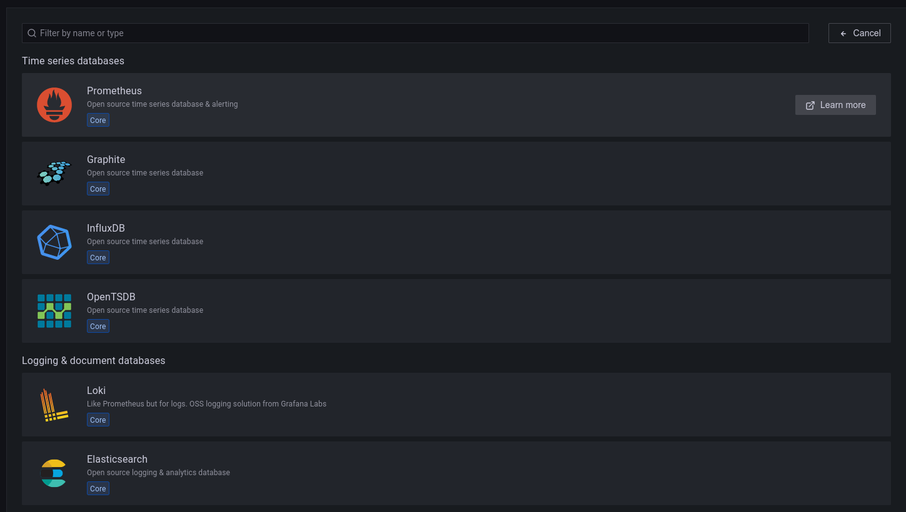

# Configuración de redes

Para poder montar nuestra estructura tenemos que tener una red interna para comunicar los diferentes nodos al igual que tenemos que tener salida a internet. Para ello vamos a configurar dos tarjetas de red, esta configuración dependerá del proveedor que se use, pero en nuestro caso para los ejemplos lo vamos a ver en Vbox.

Para ello vamos a la configuración de las maquinas virtuales y en el apartado red configuramos un adaptador en modo puente para que nos use la red del ordenador directamente y la otra la ponemos en modo red interna.



.png>)

Ahora vamos a asignarle una ip interna a nuestra red privada entre las maquinas, en ubuntu desde 18.04 LTS, la configuración de red se hace con [netplan](https://netplan.io/).

Lo primero que tenemos que saber es que dispositivos de red disponemos para ello utilizamos el comando

```bash
geekshub@nodo1:~$ ip link show
1: lo: <LOOPBACK,UP,LOWER_UP> mtu 65536 qdisc noqueue state UNKNOWN mode DEFAULT group default qlen 1000
    link/loopback 00:00:00:00:00:00 brd 00:00:00:00:00:00
2: enp0s3: <BROADCAST,MULTICAST,UP,LOWER_UP> mtu 1500 qdisc fq_codel state UP mode DEFAULT group default qlen 1000
    link/ether 08:00:27:24:0f:66 brd ff:ff:ff:ff:ff:ff
3: enp0s8: <BROADCAST,MULTICAST,UP,LOWER_UP> mtu 1500 qdisc fq_codel state UP mode DEFAULT group default qlen 1000
    link/ether 08:00:27:82:6b:e4 brd ff:ff:ff:ff:ff:ff
```

Donde vemos 3 redes la de loopback y las otras 2, la primera corresponde al adaptador puente y la segunda a la red interna en este caso, si no sabemos cual es cual podemos volver al paso anterior y en el desplegable de avanzadas nos mostrar la información.

Ahora vamos crear nuestro fichero de configuración&#x20;

```bash
geekshub@nodo1:~$ sudo vim /etc/netplan/01-netcfg.yaml
```

Con la siguiente configuración para tener una ip estática que nosotros decidamos, este proceso lo repetiremos en los HaProxys, los 3 nodos y en los 2 WAF

```vim
network:
  ethernets:
    enp0s8:
      dhcp4: false
      match:
        macaddress: 08:00:27:82:6b:e4
      set-name: enp0s8
      addresses:
        - 192.168.10.3/24
  version: 2
```

Para aplicar las configuraciones creadas ejecutamos

```bash
geekshub@nodo1:~$ netplan apply
```

Las ips internas usadas en este caso son las siguiente

* HAProxy 1 -> 192.168.10.1
* HAProxy 2 -> 192.168.10.2
* Nodo 1 -> 192.168.10.3
* Nodo 2 -> 192.168.10.4
* Nodo 3 -> 192.168.10.5
* WAF 1 -> 192.168.10.6
* WAF 2 -> 192.168.10.7
* Monitorización -> 192.168.10.100
