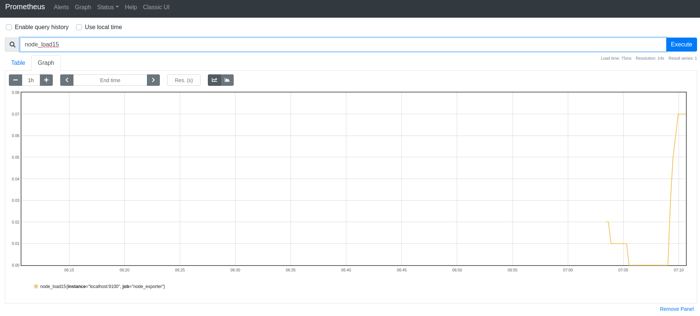
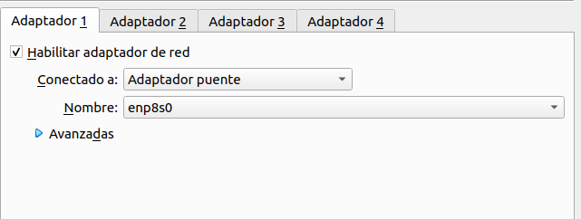

# Monitorización

Para la monitorización de nuestros sistemas vamos a usar el tandem [prometheus](https://prometheus.io/) y [grafana](https://grafana.com/)

### Prometheus

Nos servira para recuperar datos de unos sensores que pondremos en nuestros sistemas y crear alertas por si algo sucede, para empezar vamos a descargamos prometheus

```bash
wget https://github.com/prometheus/prometheus/releases/download/v2.36.0/prometheus-2.36.0.linux-amd64.tar.gzr.gz
```

Descomprimimos

```bash
tar xfz prometheus-*.tar.gz
```

Creamos el usuarios para prometehus

```bash
useradd --no-create-home --shell /usr/sbin/nologin prometheus
```

Creamos las carpetas

```bash
mkdir /etc/prometheus
mkdir /var/lib/prometheus
```

Les asignamos el usuario creado anteriormente

```bash
chown prometheus:prometheus /etc/prometheus
chown prometheus:prometheus /var/lib/prometheus
```

Entramos en la carpeta de prometheus y copiamos los binarios

```bash
cd prometheus-2.36.0.linux-amd64
cp ./prometheus /usr/local/bin/
cp ./promtool /usr/local/bin/
```

asignamos usuario prometheus

```bash
chown prometheus:prometheus /usr/local/bin/prometheus
chown prometheus:prometheus /usr/local/bin/promtool
```

Copiamos la consola y las librerías

```bash
cp -r ./consoles /etc/prometheus
cp -r ./console_libraries /etc/prometheus
```

Damos permisos

```bash
chown -R prometheus:prometheus /etc/prometheus/consoles
chown -R prometheus:prometheus /etc/prometheus/console_libraries
```

Ahora que lo tenemos instalado lo vamos a configurar, para ello creamos el siguiente fichero

```bash
vim /etc/prometheus/prometheus.yml
```

```bash
global:
  scrape_interval:     15s
  evaluation_interval: 15s

rule_files:
  # - "first.rules"
  # - "second.rules"

scrape_configs:
  - job_name: 'prometheus'
    scrape_interval: 5s
    static_configs:
      - targets: ['localhost:9090']
```

Con esto definimos cada cuanto tiene que scrapear los datos de los diferentes nodos que configuraremos más adelante

Asignamos el usuario a la configuración

```bash
chown prometheus:prometheus /etc/prometheus/prometheus.yml
```

Primer arranque de prometehus para ver que esta todo en orden, donde le decimos que configuración tiene que cargar, donde va a guardar los datos (podríamos montarlo en un glusterfs para tener una replica fuera) y la configuración de la versión web.

```bash
sudo -u prometheus /usr/local/bin/prometheus --config.file /etc/prometheus/prometheus.yml --storage.tsdb.path /var/lib/prometheus/ --web.console.templates=/etc/prometheus/consoles --web.console.libraries=/etc/prometheus/console_libraries
```

Para tenerlo en el arranque de manera automática lo vamos a configurar en systemd, para ello creamos el siguiente fichero.

```bash
vim /etc/systemd/system/prometheus.service
```

```vim
[Unit]
  Description=Prometheus Monitoring
  Wants=network-online.target
  After=network-online.target

[Service]
  User=prometheus
  Group=prometheus
  Restart=on-failure
  RestartSec=5s
  Type=simple
  ExecStart=/usr/local/bin/prometheus \
  --config.file /etc/prometheus/prometheus.yml \
  --storage.tsdb.path /var/lib/prometheus/ \
  --web.console.templates=/etc/prometheus/consoles \
  --web.console.libraries=/etc/prometheus/console_libraries
  ExecReload=/bin/kill -HUP $MAINPID

[Install]
  WantedBy=multi-user.target
```

Recargamos el demonio de systemd y ya lo tendremos disponible.

```bash
systemctl daemon-reload
```

Lo agregamos al arranque y lo arrancamos

```bash
systemctl enable prometheus
systemctl start prometheus
```

#### Nginx + SSL + Autenticación

Una opción para ayudar a proteger nuestro servidor Prometheus es colocarlo detrás de un proxy inverso para que luego podamos agregar SSL y una capa de autenticación sobre la interfaz web predeterminada sin restricciones de Prometheus.

Instalamos nginx

```bash
apt install nginx
```

Vamos a crear un sitio nuevo

```
vim /etc/nginx/sites-enabled/prometheus
```

Agregamos el siguiente contenido

```vim
server {
    listen 80;
    listen [::]:80;
    server_name  tu-dominio.com;

    location / {
        proxy_pass           http://localhost:9090/;
    }
}
```

comprobamos que las configuraciones sean correcta

```bash
nginx -t
```

Reiniciamos nginx y comprobamos su estado

```bash
systemctl start nginx
systemctl status nginx
```

Ahora ya podemos acceder a http://tu-dominio.com

Si accedemos por la ip veremos la web por defecto de nginx si no queremos que esto suceda podemos eliminar el siguiente fichero

```bash
rm /etc/nginx/sites-enabled/default
```

Ahora vamos a ponerle certificado gracias a Let’s Encrypt para ello instalamos el certbot, agregamos el repositorio.

```bash
add-apt-repository ppa:certbot/certbot
apt update
```

```bash
apt install certbot python3-certbot-nginx
```

ahora solo tenemos que ejecutar e ir respondiendo las preguntas que nos hace

```bash
certbot --nginx
```

Podemos ver los cambios que realizo certbot en el fichero de nuestro dominio

```bash
vim /etc/nginx/sites-enabled/prometheus
```

```vim
server {
    server_name  tu-dominio.com;

    location / {
        proxy_pass           http://localhost:9090/;
    }

    listen [::]:443 ssl ipv6only=on; # managed by Certbot
    listen 443 ssl; # managed by Certbot
    ssl_certificate /etc/letsencrypt/live/tu-dominio.com/fullchain.pem; # managed by Certbot
    ssl_certificate_key /etc/letsencrypt/live/tu-dominio.com/privkey.pem; # managed by Certbot
    include /etc/letsencrypt/options-ssl-nginx.conf; # managed by Certbot
    ssl_dhparam /etc/letsencrypt/ssl-dhparams.pem; # managed by Certbot

}
server {
    if ($host = tu-dominio.com) {
        return 301 https://$host$request_uri;
    } # managed by Certbot


    listen 80;
    listen [::]:80;
    server_name  tu-dominio.com;
    return 404; # managed by Certbot


}
```

Como no queremos que todo el mundo tenga acceso a nuestros datos vamos a poner una autentificación y a cerrar el puerto 9090 y 9100 para que no puedan acceder a la información de manera externa y sin autorización

Instalamos apache2-utils

```bash
apt install apache2-utils
```

Creamos un fichero de contraseñas con el usuario admin y ponemos la contraseña que queramos

```bash
htpasswd -c /etc/nginx/.htpasswd admin
```

editamos el fichero de configuración de nuestro prometheus

```bash
vim /etc/nginx/sites-enabled/prometheus
```

Y agregamos lo siguiente para que use el fichero de contraseñas

```bash
server {
    ...

    #addition authentication properties
    auth_basic  "Protected Area";
    auth_basic_user_file /etc/nginx/.htpasswd;

    location / {
        proxy_pass           http://localhost:9090/;
    }

    ...
}
```

comprobamos que las configuraciones sean correcta

```bash
nginx -t
```

Reiniciamos nginx y comprobamos su estado

```bash
systemctl restart nginx
systemctl status nginx
```

Los puertos 9000 y 9100 siguen abiertos por lo que vamos a cerrarlos con iptables

```bash
iptables -A INPUT -p tcp -s localhost --dport 9090 -j ACCEPT
iptables -A INPUT -p tcp --dport 9090 -j DROP
iptables -A INPUT -p tcp -s localhost --dport 9100 -j ACCEPT
iptables -A INPUT -p tcp --dport 9100 -j DROP
iptables -L
```

Como las iptables si se reinicia el equipo se pierden y no queremos estar agregándolas manualmente vamos a instalar el paquete iptables-persistent

```bash
apt install iptables-persistent
```

Las configuraciones se guardan en estos dos ficheros

```
/etc/iptables/rules.v4

/etc/iptables/rules.v6
```

Si hacemos algún cambio a las iptables nos tenemos que acordar de guardarlas

```bash
iptables-save > /etc/iptables/rules.v4

iptables-save > /etc/iptables/rules.v6
```

### Node exporter

Este exporter nos servira para recopilar la información de uso general de los sistemas como su CPU, memoria, procesos...&#x20;

Para ello descargamos

```bash
wget https://github.com/prometheus/node_exporter/releases/download/v1.3.1/node_exporter-1.3.1.linux-amd64.tar.gz
```

descomprimimos

```bash
tar xvf node_exporter-*.tar.gz
```

Creamos usuarios

```bash
useradd --no-create-home --shell /bin/false node_exporter
```

Entramos a la carpeta de node\_exporter y copiamos el binario

```bash
cd node_exporter-1.3.1.linux-amd64
cp ./node_exporter /usr/local/bin
```

Asignamos el usuario

```bash
chown node_exporter:node_exporter /usr/local/bin/node_exporter
```

Igual que con prometheus vamos a añadirlo en el systemd para poderlo arrancar en el arranque del sistema de manera facil.

```bash
vim /etc/systemd/system/node_exporter.service
```

```bash
[Unit]
Description=Node Exporter
Wants=network-online.target
After=network-online.target

[Service]
User=node_exporter
Group=node_exporter
Type=simple
ExecStart=/usr/local/bin/node_exporter --collector.systemd --collector.processes

[Install]
WantedBy=multi-user.target
```

recargamos systemd

```bash
systemctl daemon-reload
```

Arrancamos el node\_exporter

```bash
systemctl start node_exporter
```

Comprobamos que funciona

```bash
systemctl status node_exporter
```

Lo activamos para arranque de maquina

```bash
systemctl enable node_exporter
```

Vamos a comunicar el node\_exporter con Prometheus para ello vamos a editar la configuración de Prometheus

```bash
vim /etc/prometheus/prometheus.yml
```

Y añadimos lo siguiente en la zona de scrape\_configs

```bash
  - job_name: 'node_exporter'
    scrape_interval: 5s
    static_configs:
      - targets: ['localhost:9100']
```

&#x20;Reiniciamos prometheus

```bash
systemctl restart prometheus
```

Ahora repetimos el proceso con el resto de los nodos y servidores de nuestro HA y ya podemos consultar la información de los diferentes nodos



### HAProxy Exporter

Este exporter nos servira para recopilar la información de nuestros HAProxys y saber sus conexiónes, que va a cada nodo...

Para ello descargamos

```bash
wget https://github.com/prometheus/haproxy_exporter/releases/download/v0.13.0/haproxy_exporter-0.13.0.linux-amd64.tar.gz
```

descomprimimos

```bash
tar xvf haproxy_exporter-*.tar.gz
```

Creamos usuarios

```bash
useradd --no-create-home --shell /bin/false haproxy_exporter
```

Entramos a la carpeta de haproxy\_exporter y copiamos el binario

```bash
cd haproxy_exporter-0.13.0.linux-amd64
cp ./haproxy_exporter /usr/local/bin
```

Asignamos el usuario

```bash
chown haproxy_exporter:haproxy_exporter /usr/local/bin/haproxy_exporter
```

Igual que con prometheus vamos a añadirlo en el systemd para poderlo arrancar en el arranque del sistema de manera facil.

```bash
vim /etc/systemd/system/haproxy_exporter.service
```

```bash
[Unit]
Description=Haproxy Exporter
Wants=network-online.target
After=network-online.target

[Service]
User=haproxy_exporter
Group=haproxy_exporter
Type=simple
ExecStart=/usr/local/bin/haproxy_exporter --haproxy.scrape-uri=http://127.0.0.1:5000/haproxy?stats\;csv

[Install]
WantedBy=multi-user.target
```

recargamos systemd

```bash
systemctl daemon-reload
```

Arrancamos el haproxy\_exporter

```bash
systemctl start haproxy_exporter
```

Comprobamos que funciona

```bash
systemctl status haproxy_exporter
```

Lo activamos para arranque de maquina

```bash
systemctl enable haproxy_exporter
```

Configuramos el HAProxy para poder recopilar la Información con nuestro haproxy\_exporter para ello añadimos el siguiente bloque

```bash
vim /etc/haproxy/haproxy.cfg
```

```vim
listen stats
        bind 127.0.0.1:5000
        stats enable
        stats uri /haproxy?stats

```

Vamos a comunicar el haproxy\_exporter con Prometheus para ello vamos a editar la configuración de Prometheus

```bash
vim /etc/prometheus/prometheus.yml
```

Y añadimos lo siguiente en la zona de scrape\_configs

```bash
  - job_name: 'ha1_haproxy_exporter'
    scrape_interval: 5s
    static_configs:
      - targets: ['192.168.10.1:9101']
```

&#x20;Reiniciamos prometheus

```bash
systemctl restart prometheus
```

### Apache exporter

Para monitorizar apache tenemos que tener el modulo de `mod_status` activado y la locacilizacion `/server-status` activada en este caso ubuntu lo trate configurado por defecto, por lo que no tendriamos que tocar nada.

Para poder usar el exporter lo primero que tenemos que hacer es instalar Go, lo podemos hacer desde los binarios o desde el repositorio como no vamos a programar en este caso lo instalaremos desde los repositorios.

```bash
sudo apt install golang-go 
```

Vamos a crear un usuario para el exporter como en los otros casos

```bash
 useradd apache_exporter -s /sbin/nologin
```

Ahora vamos a bajar el codigo de la ultima version y vamos a compilarlo, nos clonamos el repositorio

```bash
git clone https://github.com/Lusitaniae/apache_exporter.git
cd apache_exporter
```

Instalamos las dependencias de Go y compilamos

```bash
go get -v github.com/Lusitaniae/apache_exporter
go build
```

Copiamos el fichero generado

```bash
cp apache_exporter /usr/sbin/
```

Le damos permisos

```bash
chown apache_exporter:apache_exporter /usr/sbin/apache_exporter
```

Lo agregamos a systemd

```bash
vim /etc/systemd/system/apache_exporter.service
```

```vim
[Unit]
Description=Apache Exporter
Wants=network-online.target
After=network-online.target

[Service]
User=apache_exporter
Group=apache_exporter
Type=simple
Restart=always
EnvironmentFile=/etc/sysconfig/apache_exporter
ExecStart=/usr/sbin/apache_exporter $OPTIONS

[Install]
WantedBy=multi-user.target
```

Generamos la configuración, donde escuchamos y donde publicamos la Información para prometheus

```bash
vim /etc/apache_exporter
```

```vim
OPTIONS="--scrape_uri='http://127.0.0.1/server-status/?auto' --telemetry.address='192.168.10.4:9117'"
```

Recargarmos systemd

```bash
systemctl daemon-reload
systemctl start apache_exporter
systemctl enable apache_exporter
```

Agregamos a prometheus el exporter

```vim
  - job_name: 'node1-apache'
    static_configs:
      - targets: ['xxx.xxx.xxx.xxx:9117']
```

### Mysql Exporter

Vamos a monitorizar nuestro cluster de galera, para ello lo primera que hacemos en uno de los nodos crear un usuario

```sql
CREATE USER 'exporter'@'localhost' IDENTIFIED BY 'XXXXXXXX' WITH MAX_USER_CONNECTIONS 3;
GRANT PROCESS, REPLICATION CLIENT, REPLICATION SLAVE, SUPER SELECT ON *.* TO 'exporter'@'localhost
FLUSH PRIVILEGES;
```

Descargamos el mysql exporter en todos los nodos

```bash
wget https://github.com/prometheus/mysqld_exporter/releases/download/v0.14.0/mysqld_exporter-0.14.0.linux-amd64.tar.gz
```

descomprimimos

```bash
tar xvf mysqld_exporter-*.tar.gz
```

Creamos usuarios

```bash
useradd --no-create-home --shell /bin/false mysql_exporter
```

Entramos a la carpeta de `mysql_exporter` y copiamos el binario

```bash
cd mysqld_exporter-0.14.0.linux-amd64
cp ./mysqld_exporter /usr/local/bin/
```

Asignamos el usuario

```bash
chown mysql_exporter:mysql_exporter /usr/local/bin/mysqld_exporter
```


Los datos de conexión los ponemos dentro del systemd dado que usando el parametro _config.my-cnf_ nos falla la conexión&#x20;


```bash
vim /etc/systemd/system/mysql_exporter.service
```

```bash
[Unit]
Description=Prometheus MySQL Exporter
Wants=network-online.target
After=network-online.target

[Service]
User=mysql_exporter
Group=mysql_exporter
Type=simple
Restart=always
Environment='DATA_SOURCE_NAME=exporter:exp789@(192.168.10.3:3306)/'
ExecStart=/usr/local/bin/mysqld_exporter --collect.info_schema.tables --collect.info_schema.tablestats

[Install]
WantedBy=multi-user.target
```

recargamos systemd

```bash
systemctl daemon-reload
```

Arrancamos el mysql\_exporter

```bash
systemctl start mysql_exporter
```

Comprobamos que funciona

```bash
systemctl status mysql_exporter
```

Lo activamos para arranque de maquina

```bash
systemctl enable mysql_exporter
```

Vamos a comunicar el `mysql_exporter` con Prometheus para ello vamos a editar la configuración de Prometheus

```bash
vim /etc/prometheus/prometheus.yml
```

Y añadimos lo siguiente en la zona de `scrape_configs`

```vim
  - job_name: "node1-mysql"
    scrape_interval: "15s"
    static_configs:
      - targets: ['xxx.xxx.xxx.xxx:9104']
```

&#x20;Reiniciamos prometheus

```bash
systemctl restart prometheus
```

Ahora repetimos el proceso con el resto de los nodos de galera pero sin tener que crear el usuario porque ya se replico automáticamente.

### Memcached Exporter

Este exporter nos servira para recopilar la información de nuestros memcached y ver los estados de las sesiones.

Para ello descargamos

```bash
wget https://github.com/prometheus/memcached_exporter/releases/download/v0.9.0/memcached_exporter-0.9.0.linux-amd64.tar.gz
```

descomprimimos

```bash
tar xvf memcached_exporter-*.tar.gz
```

Creamos usuarios

```bash
useradd --no-create-home --shell /bin/false memcached_exporter
```

Entramos a la carpeta de memcached\_exporter y copiamos el binario

```bash
cd memcached_exporter-0.9.0.linux-amd64
cp ./memcached_exporter /usr/local/bin
```

Asignamos el usuario

```bash
chown memcached_exporter:memcached_exporter /usr/local/bin/memcached_exporter
```

Igual que con prometheus vamos a añadirlo en el systemd para poderlo arrancar en el arranque del sistema de manera facil.

```bash
vim /etc/systemd/system/memcached_exporter.service
```

```bash
[Unit]
Description=memcached  Exporter
Wants=network-online.target
After=network-online.target

[Service]
User=memcached_exporter
Group=memcached_exporter
Type=simple
ExecStart=/usr/local/bin/memcached_exporter --memcached.address 192.168.10.X:11211 -web.listen-address 192.168.10.X:9150


[Install]
WantedBy=multi-user.target
```

recargamos systemd

```bash
systemctl daemon-reload
```

Arrancamos el memcached\_exporter

```bash
systemctl start memcached_exporter
```

Comprobamos que funciona

```bash
systemctl status memcached_exporter
```

Lo activamos para arranque de maquina

```bash
systemctl enable memcached_exporter
```

Vamos a comunicar el memcached\_exporter con Prometheus para ello vamos a editar la configuración de Prometheus

```bash
vim /etc/prometheus/prometheus.yml
```

Y añadimos lo siguiente en la zona de scrape\_configs

```bash
  - job_name: 'node1-memcache'
    scrape_interval: 5s
    static_configs:
      - targets: ['192.168.10.1:9150']
```

&#x20;Reiniciamos prometheus

```bash
systemctl restart prometheus
```

### Agrupando exporters

Hasta ahora hemos ido agregando los exporter de manera independiente por tipo y servidor lo que lo hace poco mantenible a lo largo del tiempo

```vim
scrape_configs:
  - job_name: 'node_exporter_prometheus'
    scrape_interval: 5s
    static_configs:
      - targets: ['localhost:9090']
  - job_name: 'prometheus_node_exporter'
    scrape_interval: 5s
    static_configs:
      - targets: ['localhost:9100']
  - job_name: 'node-1_node_exporter'
    scrape_interval: 5s
    static_configs:
      - targets: ['192.168.10.3:9100']
  - job_name: "node1-mysql"
    scrape_interval: "15s"
    static_configs:
      - targets: ['192.168.10.3:9104']
 - job_name: 'node1-apache'
    static_configs:
      - targets: ['192.168.10.3:9117']
  - job_name: 'node-2_node_exporter'
    scrape_interval: 5s
    static_configs:
      - targets: ['192.168.10.4:9100']
  - job_name: "node2-mysql"
    scrape_interval: "15s"
    static_configs:
      - targets: ['192.168.10.4:9104']
 - job_name: 'node2-apache'
    static_configs:
      - targets: ['192.168.10.4:9117']
  - job_name: 'node-3_node_exporter'
    scrape_interval: 5s
    static_configs:
      - targets: ['192.168.10.5:9100']
  - job_name: "node3-mysql"
    scrape_interval: "15s"
    static_configs:
      - targets: ['192.168.10.5:9104']
 - job_name: 'node3-apache'
    static_configs:
      - targets: ['192.168.10.5:9117']
 - job_name: 'waf-1_node_exporter'
    scrape_interval: 5s
    static_configs:
      - targets: ['192.168.10.6:9100']
 - job_name: 'node-2_node_exporter'
    scrape_interval: 5s
    static_configs:
      - targets: ['192.168.10.7:9100']
 - job_name: 'HA1_node_exporter'
    scrape_interval: 5s
    static_configs:
      - targets: ['192.168.10.1:9100']
 - job_name: 'HA2_node_exporter'
    scrape_interval: 5s
    static_configs:
      - targets: ['192.168.10.2:9100']
 - job_name: 'HA1_haproxy_exporter'
    scrape_interval: 5s
    static_configs:
      - targets: ['192.168.10.1:9101']
 - job_name: 'HA2_haproxy_exporter'
    scrape_interval: 5s
    static_configs:
      - targets: ['192.168.10.2:9101']
 - job_name: 'node1_memcached_exporter'
    scrape_interval: 5s
    static_configs:
      - targets: ['192.168.10.3:9150']
 - job_name: 'node2_memcached_exporter'
    scrape_interval: 5s
    static_configs:
      - targets: ['192.168.10.4:9150']
 - job_name: 'node3_memcached_exporter'
    scrape_interval: 5s
    static_configs:
      - targets: ['192.168.10.5:9150']
```

Lo que vamos a hacer ahora es agruparlos por tipos de exporters para que nos sea mas facil de mantener.

```vim
scrape_configs:
  - job_name: 'prometheus_master'
    scrape_interval: 5s
    static_configs:
      - targets:
        - localhost:9090
  - job_name: 'node'
    scrape_interval: 5s
    static_configs:
      - targets:
        - 192.168.10.6:9100
        - 192.168.10.7:9100
        labels:
          type: 'WaF'
      - targets:
        - 192.168.1.100:9100
        labels:
          type: 'monitorig'
      - targets:
        - 192.168.1.3:9100
        - 192.168.1.4:9100
        - 192.168.1.5:9100
        labels:
          type: 'Node'
      - targets:
        - 192.168.1.1:9100
        - 192.168.1.2:9100
        labels:
          type: 'HAproxy'

  - job_name: 'memcached'
    scrape_interval: 5s
    static_configs:
      - targets:
        - 192.168.1.3:9150
        labels:
          node: 'node1'
      - targets:
        - 192.168.1.4:9150
        labels:
          node: 'node2'
      - targets:
        - 192.168.1.5:9150
        labels:
          node: 'node3'

  - job_name: 'apache'
    scrape_interval: 5s
    static_configs:
      - targets:
        - 192.168.1.3:9117
        labels:
          node: 'node1'
      - targets:
        - 192.168.1.4:9117
        labels:
          node: 'node2'
      - targets:
        - 192.168.1.5:9117
        labels:
          node: 'node3'
      - targets:
        - 192.168.1.6:9117
        labels:
          node: 'WaF1'
      - targets:
        - 192.168.1.7:9117
        labels:
          node: 'WaF2'

  - job_name: 'haproxy'
    scrape_interval: 5s
    static_configs:
      - targets:
        - 192.168.1.1:9101
        labels:
          node: 'HA1'
      - targets:
        - 192.168.1.2:9101
        labels:
          node: 'HA2'
          
  - job_name: 'mysql'
    scrape_interval: 5s
    static_configs:
      - targets:
        - 192.168.1.3:9104
        labels:
          node: 'node1'
      - targets:
        - 192.168.1.4:9104
        labels:
          node: 'node2'
      - targets:
        - 192.168.1.5:9104
        labels:
          node: 'node3'
```

### Alertmanager

Ahora que tenemos la monitorizacion montada tendremos que configurar las alertas para que nos sea util, para ello vamos a usar alertmanager

```bash
wget https://github.com/prometheus/alertmanager/releases/download/v0.24.0/alertmanager-0.24.0.linux-amd64.tar.gz
```

Descomprimimos

```bash
tar xfz alertmanager-*.tar.gz
```

Entramos en la carpeta y copiamos los binarios

```bash
cd alertmanager-0.24.0.linux-amd64
cp ./alertmanager /usr/local/bin/
cp ./amtool /usr/local/bin/
```

Creamos la carpeta para la configuracion

```bash
mkdir /etc/alertmanager
```

Creamos el usuario

```
useradd --no-create-home --shell /usr/sbin/nologin alertmanager
```

Asignamos permisos

```bash
chown alertmanager:alertmanager /etc/alertmanager
chown alertmanager:alertmanager /usr/local/bin/alertmanager
chown alertmanager:alertmanager /usr/local/bin/amtool
```

Creamos la configuracion para recibir las alertas por email

```bash
vim /etc/alertmanager/alertmanager.yml
```

```vim
  group_by: [Alertname]
  receiver: email-me

receivers:
- name: email-me
  email_configs:
  - to: email@domain.com
    from: email@domain.com
    smarthost: server:port
    auth_username: "email@domain.com"
    auth_identity: "email@domain.com"
    auth_password: "password"

```

Lo agregamos a systemd

```bash
vim /etc/systemd/system/alertmanager.service
```

```vim
[Unit]
Description=AlertManager Server Service
Wants=network-online.target
After=network-online.target

[Service]
User=alertmanager
Group=alertmanager
Type=simple
Restart=always
ExecStart=/usr/local/bin/alertmanager --config.file /etc/alertmanager/alertmanager.yml 

[Install]
WantedBy=multi-user.target

```

Recargamos el demonio de systemd y ya lo tendremos disponible.

```bash
systemctl daemon-reload
```

Lo agregamos al arranque y lo arrancamos

```bash
systemctl enable alertmanager
systemctl start alertmanager
```

Para crear las alertas vamos a creamos el siguiente fichero, con reglas para saber si los nodos estan levantados, se saturan de memoria o los discos estan llenos.

```bash
vim /etc/prometheus/alert_rules.yml
```

```vim
groups:
- name: ExporterDown
  rules:
  - alert: NodeDown
    expr: up{job='node'} == 0
    for: 1m
    labels:
      severity: Error
    annotations:
      summary: "Node Explorer instance {{ $labels.instance }}  down"
      description: "NodeExporterDown"

- name: ApacheDown
  rules:
  - alert: ApacheDown
    expr: apache_up{} == 0
    for: 1m
    labels:
      severity: Error
    annotations:
      summary: "Apache instance {{ $labels.instance }} down"
      description: "ApacheExpoterDown"

- name: HADown
  rules:
  - alert: HAProxyDown
    expr: haproxy_up{} == 0
    for: 1m
    labels:
      severity: Error
    annotations:
      summary: "HAProxy instance {{ $labels.instance }} down"
      description: "HAProxyExpoterDown"


- name: Memory
  rules:
  - alert: FullMemory
    expr: (100 - ((node_memory_MemAvailable_bytes{job="node"} * 100) / node_memory_MemTotal_bytes{job="node"})) >= 85
    for: 3m
    labels:
      severity: High
    annotations:
      summary: "85% Memory more than 3m instance {{ $labels.instance }}"
      description: "FullMemory"

- name: HD
  rules:
  - alert: FullHD
    expr: (100 - ((node_filesystem_avail_bytes{job="node",mountpoint="/",fstype!="rootfs"} * 100) / node_filesystem_size_bytes{job="node",mountpoint="/",fstype!="rootfs"})) >= 85
    for: 60m
    labels:
      severity: Critical
    annotations:
      summary: "85% HD Full more than 1h instance {{ $labels.instance }}"
      description: "FullHD"
  

```

Ahora vamos a agregar las reglas creadas a prometheus

```bash
vim /etc/prometheus/prometheus.yml
```

```vim
rule_files:
  - "alert_rules.yml"


alerting:
  alertmanagers:
  - static_configs:
    - targets:
      - localhost:9093
```

Reiniciamos prometheus

```
systemctl restart prometheus
```

### Grafana

Vamos a instalar ahora Grafana para poder ver de manera sencilla los datos que tiene prometheus, para ello vamos a agregar los repositorios oficiales para tener siempre la ultima version

```bash
apt install -y apt-transport-https
apt install -y software-properties-common wget
wget -q -O - https://packages.grafana.com/gpg.key | sudo apt-key add -
echo "deb https://packages.grafana.com/oss/deb stable main" | sudo tee -a /etc/apt/sources.list.d/grafana.list
```

Acutalizamos los repositorios e instalamos

```bash
apt update
apt install grafana
```

Arrancamos el servico y cargamos en el arranque

```bash
systemctl daemon-reload
systemctl start grafana-server
systemctl enable grafana-server
systemctl status grafana-server
```

Ahora vamos aprovechar el certificado que hemos solicitado para el dominio de prometheus, dado que vamos a usar el mismo nombre de dominio pero por el puerto 3000 que es el por defecto de grafana.

Vamos a crear un pequeño script para el deploy de los certificados para grafana.

```bash
mkdir /opt/cerbot
vim /opt/certbot/deployhook.sh
```

```vim
cp /etc/letsencrypt/live/tu-dominio.com/cert.pem /etc/grafana -f
cp /etc/letsencrypt/live/tu-dominio.com/privkey.pem /etc/grafana -f
chown grafana:grafana /etc/grafana/*.pem
chmod 644 /etc/grafana/*.pem
systemctl restart grafana-server
```

creamos ahora en el crontab la renovacion diciendole que deploy-hook tiene que usar

```vim
47 10 * * * /usr/bin/certbot renew --deploy-hook /opt/certbot/deployhook.sh
```

Ahora solo nos queda configurar grafana para que lo use.

```bash
vim /etc/grafana/grafana.ini
```

```vim
#################################### Server ####################################
[server]
# Protocol (http, https, h2, socket)
protocol = https

# The ip address to bind to, empty will bind to all interfaces
;http_addr =

# The http port  to use
http_port = 3000

# The public facing domain name used to access grafana from a browser
domain = tu-dominio.com

# Redirect to correct domain if host header does not match domain
# Prevents DNS rebinding attacks
enforce_domain = true

# The full public facing url you use in browser, used for redirects and emails
# If you use reverse proxy and sub path specify full url (with sub path)

# Serve Grafana from subpath specified in `root_url` setting. By default it is set to `false` for compatibility reasons.
;serve_from_sub_path = false

# Log web requests
;router_logging = false

# the path relative working path
;static_root_path = public

# enable gzip
;enable_gzip = false

# https certs & key file
cert_file =/etc/grafana/cert.pem
cert_key =/etc/grafana/privkey.pem

```

ahora ingresamos en nuestro grafana y ponemos el usuario y contraseña por defecto que es admin:admin nada mas introducirlo nos pedira cambiarlo por la que nosotros queramos.

 (1).png>)

Una vez dentro vamos a configurar algunos dashboard para ver los datos de prometheus,[ hay muchos creados](https://grafana.com/grafana/dashboards/) que son los que vamos a usar o podriamos crear los nuestros propios.

Antes de empezar a graficar cosas necesitamos decirle a grafana de donde va a sacar los datos para ello vamos Configuration -> Data Sources y agregamos la fuente que queramos en este caso prometheus



Rellenamos nuestra configuracion hay que acordarse de poner la Basic auth para que podamos recoger los datos.

.png>)

Una vez que tenemos el DataSource configurado buscamos el dashboard que nos interesa y nos copiamos su identificador

.png>)

Ahora nos dirigimos a Dashbard -> import y pegamos el id del dashboard

.png>)

Lo cargamos y le decimos que Data Source usuara.

.png>)

.png>)

Ahora ya solo nos queda agregar los Dashboard que nosotros queramos.
